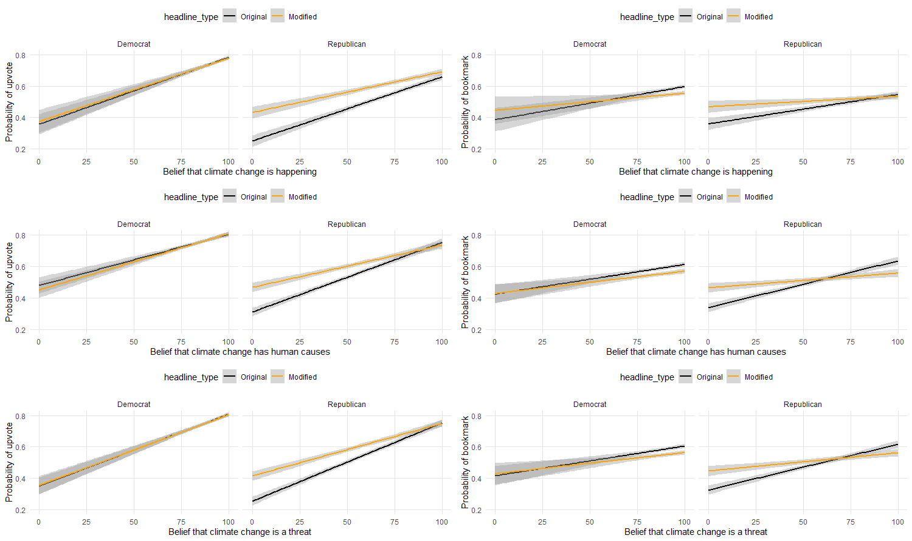
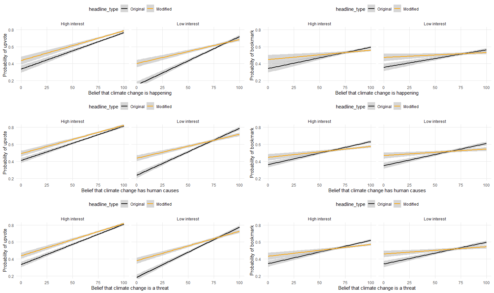

<style>

  .page-break {
    page-break-before: always;  
    break-before: page;       
    page-break-after: avoid;    
  }
</style>


```{r package, include=FALSE}
library(tidyverse)
library(lmerTest)
library(ggplot2)
library(tidyr)
library(ggplot2)
library(httr)
library(readxl)
library(purrr)
library(dplyr)
library(tidytext)
library(textdata)
library(moments)
library(tinytex)
library(knitr)
library(htmltools)
library(sjPlot)
library(jsonlite)
library(dplyr)
library(gridExtra)
```


```{r management, include=FALSE}
column_names <- names(read.csv("personalization_social_media_June 28, 2024_05.24.csv", nrows = 1))

df <- read.csv("personalization_social_media_June 28, 2024_05.24.csv", sep=",", header = FALSE, skip=134)

names(df) <- column_names

df <- df %>%
  mutate(across(starts_with("bookmarked"), ~ ifelse(is.na(.) | . == '', 'false', .)))%>%
  mutate(upvote_regret=ifelse(upvote_regret==1,1,0))

duplicates <- df[duplicated(df$prolific), ]
##there is one p duplicate that produced no data twice. excluding it
df <- df[!duplicated(df$prolific), ]

prolificdf <- read.csv("prolific_export_667bcfe8d8e8186ce82f5edf.csv", sep=",", header = TRUE)

df= df %>%
  left_join(prolificdf, by = c('prolific' = 'Participant.id'))

ratings_columns <- grep("^vote[0-9]+$", colnames(df), value = TRUE)
statement_columns <- grep("^title[0-9]+$", colnames(df), value = TRUE)

ratings_columns <- sort(ratings_columns)
statement_columns <- sort(statement_columns)

df_long_votes <- df %>%
  select(prolific, all_of(ratings_columns)) %>%
  pivot_longer(
    cols = all_of(ratings_columns),
    names_to = "number",
    values_to = "vote",
    names_pattern = "vote([0-9]+)"
  )

df_long_titles <- df %>%
  select(prolific, all_of(statement_columns)) %>%
  pivot_longer(
    cols = all_of(statement_columns),
    names_to = "number",
    values_to = "title",
    names_pattern = "title([0-9]+)"
  )

df_long_vote <- df_long_votes %>%
  left_join(df_long_titles, by = c("prolific", "number"))

bookmark_columns <- grep("^bookmarked[0-9]+$", colnames(df), value = TRUE)
bookmarked_title_columns <- grep("^bookmarkedtitle[0-9]+$", colnames(df), value = TRUE)

bookmark_columns <- sort(bookmark_columns)
bookmarked_title_columns <- sort(bookmarked_title_columns)

df_long_bookmark <- df %>%
  select(prolific, all_of(bookmark_columns)) %>%
  pivot_longer(
    cols = all_of(bookmark_columns),
    names_to = "bookmarkorder",
    values_to = "bookmarked",
    names_pattern = "bookmarked([0-9]+)"
  )

df_long_bookmarked_titles <- df %>%
  select(prolific, all_of(bookmarked_title_columns)) %>%
  pivot_longer(
    cols = all_of(bookmarked_title_columns),
    names_to = "bookmarkorder",
    values_to = "bookmarkedtitle",
    names_pattern = "bookmarkedtitle([0-9]+)"
  )

df_long_bookmarked <- df_long_bookmark %>%
  left_join(df_long_bookmarked_titles, by = c("prolific", "bookmarkorder"))

final_df <- df_long_vote %>%
  left_join(df_long_bookmarked, by = c("prolific", "title" = "bookmarkedtitle"))


url <- "https://raw.githubusercontent.com/bencebago/news_personalization/main/filtered_data_experiment.json"
json_data <- fromJSON(url)
json_titles <-  c(json_data$title, json_data$selected_title_AbsoluteDenier)


# Assuming final_df is already created as per previous steps
# Create a new variable 'type' in final_df
final_df <- final_df %>%
  mutate(type = ifelse(title %in% json_titles, 'climate', 'neutral'))

##from original json I i should add the index for each each title for item nr that will be used for joining with the different datasets. 


####some analysis will be run on original dataset, like posterior analysis


## add columns to original dataset, most importantly climate change denier classification and statistics. 
df = df%>%
  mutate(climate_figure = ifelse(climate2==1, "Believer", ifelse(climate2==2|climate2==3|climate2==5, 'Denier', NA)),
         climate_stat = ifelse(climate2==1, 1, ifelse(climate2==2|climate2==3, -1, 0)),
         condition_stat = ifelse(condition=='original', 0, 1),
         cause_change = prior_cause_1 - posterior_cause_1,
         risk_change = prior_risk_1 - posterior_risk_1,
         happen_change = prior_happen_1 - posterior_happen_1,
         
         prior_happen_1_category = cut(prior_happen_1, 
                                       breaks = c(0, 25, 50, 75, 100), 
                                       include.lowest = TRUE, 
                                       labels = c("0-25", "26-50", "51-75", "76-100")),
        prior_cause_1_category = cut(prior_cause_1, 
                                       breaks = c(0, 25, 50, 75, 100), 
                                       include.lowest = TRUE, 
                                       labels = c("0-25", "26-50", "51-75", "76-100")),
        prior_cause_unscaled = prior_cause_1,
        prior_happen_unscaled = prior_happen_1,
        prior_risk_unscaled = prior_risk_1,
        prior_cause_1 = scale(prior_cause_1),
        prior_happen_1 = scale(prior_happen_1),
        prior_risk_1 = scale(prior_risk_1),
        Education = ifelse(Educational.Level > 3, 1, -1),
        Partisanship = ifelse(DemRep_C < 4, DemRep_C-4, DemRep_C-3),
        partisan_identity = ifelse(Partisanship < 0, 'Democrat', 'Republican'),
        Q6..Ideology_econ = ifelse(Q6..Ideology_econ < 4, Q6..Ideology_econ-4, Q6..Ideology_econ-3),
        Q7..Ideology_social = ifelse(Q7..Ideology_social < 4, Q7..Ideology_social-4, Q7..Ideology_social-3),
        Ideology = rowMeans(cbind(Q6..Ideology_econ, Q7..Ideology_social), na.rm = TRUE),
        Ideology=scale(Ideology),
        Partisanship=scale(Partisanship),
        Interest = scale(Interest_1),
        Sex = ifelse(Sex=='Female', -1, 1),
        Age=scale(as.numeric(Age)))


####
additional_columns <- c("condition", "climate1", "climate2", "prior_cause_1", "prior_happen_1", "prior_risk_1",
                        "P2..Attention.Check1", "Q6..Ideology_econ", "Q7..Ideology_social", "DemRep_C",
                        "Interest_1", "Interest_2", "Interest_3", "Interest_4", "Interest_5", "Interest_6", "Interest_7",
                        "Educational.Level", "bookmark_regret_1", "upvote_regret", "credibility_1", "selectedValue",
                        "posterior_cause_1", "posterior_happen_1", "posterior_risk_1", 'Q110', 'Q111', 'Q133', 'Q134', 'condition_stat', 'climate_stat', 'climate_figure', 'condition_stat', 'Education', 'Age', 'Sex', 'Interest', 'Ideology', 'Partisanship','prior_happen_1_category','prior_cause_1_category', 'partisan_identity','prior_cause_unscaled', 'prior_risk_unscaled', 'prior_happen_unscaled')

additional_columns <- additional_columns[additional_columns %in% colnames(df)]

final_df <- final_df %>%
  left_join(df %>% select(prolific, all_of(additional_columns)), by = "prolific")%>%
  mutate(vote=ifelse(vote=='upvote',1,0),
         bookmarked=ifelse(bookmarked=="true",1,0))
  
         
 df2 <- df %>%
  left_join(final_df %>% select(title, vote, prolific), 
            by = c("selectedValue" = "title", "prolific" = "prolific"))%>%
  mutate(voteregret = ifelse(vote==1 & upvote_regret==1, '11', ifelse(vote==1 & upvote_regret==0, '10', ifelse(vote==0 & upvote_regret==1, '01', '00'))))
 
df2_clean_vote = df2 %>%
    filter(voteregret== '10'| voteregret=='11')%>%
mutate(statvoteregret = ifelse(voteregret=='10', 1,0))
        


rm(list = setdiff(ls(), c("df", "final_df", 'df2_clean_vote')))

```


## Note on coding
Here, we report standardized beta coefficients. All continuous variables were scaled and centered (including partisanship, ideology, interest in science news, credibility, bookmark regret, age, continuous priors on climate change). The experimental Treatment variable was dummy coded (0 - Original headlines, 1 - Flipped headlines),  while the rest of the demographic variables were sum coded to aid interpretability of the results as they do not have natural reference levels (Education: 1 - Collage or higher, -1 - Less than collage; Sex: 1 - Male, -1 - Female; Categorical climate belief: 1 - Believer, 0 - Other or don't know, -1: Denier). Votes and bookmarks were always dependent variables, and were coded as 0 (downvoted, not bookmarked) or 1 (upvoted, bookmarked). Models that had votes or bookmarks as dependent variables always included titles and IDs as random intercepts, while models that predicted credibility or regret always included titles as random intercepts (there were no variation on the individual level as all participants had only one rating in these metrics). 

## Preregistered analysis on engagement

```{r engagement analysis, echo=FALSE, warning=FALSE, message=FALSE, results='asis'}

final_df_filtered = final_df %>%
  filter(type == 'climate')

model1_vote <- lmer(vote ~ climate_stat *  condition_stat + (1 | title) + (1 | prolific), data = final_df_filtered, na.action = na.omit)
model2_vote <- lmer(vote ~ prior_happen_1 *  condition_stat + (1 | title) + (1 | prolific), data = final_df_filtered, na.action = na.omit)
model3_vote <- lmer(vote ~ prior_cause_1 *  condition_stat + (1 | title) + (1 | prolific), data = final_df_filtered, na.action = na.omit)
model4_vote <- lmer(vote ~ prior_risk_1 *  condition_stat + (1 | title) + (1 | prolific), data = final_df_filtered, na.action = na.omit)

model1_bookmark <- lmer(bookmarked ~ climate_stat *  condition_stat + (1 | title) + (1 | prolific), data = final_df_filtered, na.action = na.omit)
model2_bookmark <- lmer(bookmarked ~ prior_happen_1 *  condition_stat + (1 | title) + (1 | prolific), data = final_df_filtered, na.action = na.omit)
model3_bookmark <- lmer(bookmarked ~ prior_cause_1 *  condition_stat + (1 | title) + (1 | prolific), data = final_df_filtered, na.action = na.omit)
model4_bookmark <- lmer(bookmarked ~ prior_risk_1 *  condition_stat + (1 | title) + (1 | prolific), data = final_df_filtered, na.action = na.omit)


filtered_data <- final_df_filtered %>%
  filter(climate2 %in% c(2, 3))

# Calculate the percentage of people who voted (vote == 1) in both control and treatment groups
vote_control <- filtered_data %>%
  filter(condition_stat == 0) %>%
  summarise(percent_voted = mean(vote) * 100) %>%
  pull(percent_voted)

vote_treatment <- filtered_data %>%
  filter(condition_stat == 1) %>%
  summarise(percent_voted = mean(vote) * 100) %>%
  pull(percent_voted)

# Calculate the percentage increase in voting between the control and treatment groups
percentage_increase <- ((vote_treatment - vote_control) / vote_control) * 100


bookmarked_control <- filtered_data %>%
  filter(condition_stat == 0) %>%
  summarise(percent_bookmarkedd = mean(bookmarked) * 100) %>%
  pull(percent_bookmarkedd)

bookmarked_treatment <- filtered_data %>%
  filter(condition_stat == 1) %>%
  summarise(percent_bookmarkedd = mean(bookmarked) * 100) %>%
  pull(percent_bookmarkedd)

# Calculate the percentage increase in voting between the control and treatment groups
percentage_increase_bookmarked <- ((bookmarked_treatment - bookmarked_control) / bookmarked_control) * 100


style <- htmltools::tags$style(HTML("
  table {
    border-collapse: collapse;
    width: 100%;
  }
  th, td {
    padding: 8px;
    text-align: left;
    border-bottom: 1px solid #ddd;
  }
  td:nth-child(2) {
    padding-right: 30px;  /* Add more space between Estimate and Std. Error */
  }
"))

pred_labels <- c('Intercept', "Prior",  "Treatment",  "Prior * Treatment")


tab_model(model1_vote, model1_bookmark,
          dv.labels = c("Vote", "Bookmark"),  
          pred.labels = pred_labels,  
          title = "Table S1. Regression Results for Categorical Climate Belief",
          show.ci = FALSE, 
          show.p = TRUE,
          show.se = TRUE, 
          show.re.var = FALSE, 
          show.icc = FALSE,     
          digits = 3,
          show.ngroups = FALSE)
cat('<div class="page-break"></div>')


tab_model(model2_vote, model2_bookmark,
          dv.labels = c("Vote", "Bookmark"),
          pred.labels = pred_labels,
          title = "Table S2. Regression Results for Prior on Climate Change is Happening",
          show.ci = FALSE, 
          show.p = TRUE,
          show.se = TRUE, 
          show.re.var = FALSE,  
          show.icc = FALSE,     
          digits = 3,
          show.ngroups = FALSE)

cat('<div class="page-break"></div>')

tab_model(model3_vote, model3_bookmark,
          dv.labels = c("Vote", "Bookmark"),
          pred.labels = pred_labels,
          title = "Table S3. Regression Results for Prior on Climate Change Caused by Humanity",
          show.ci = FALSE, 
          show.p = TRUE,
          show.se = TRUE, 
          show.re.var = FALSE,  
          show.icc = FALSE,     
          digits = 3,
          show.ngroups = FALSE)

cat('<div class="page-break"></div>')

tab_model(model4_vote, model4_bookmark,
          dv.labels = c("Vote", "Bookmark"),
          pred.labels = pred_labels,
          title = "Table S4. Regression Results for Prior on Climate Change is Risky",
          show.ci = FALSE, 
          show.p = TRUE,
          show.se = TRUE, 
          show.re.var = FALSE,  
          show.icc = FALSE,     
          digits = 3,
          show.ngroups = FALSE)
cat('<div class="page-break"></div>')

htmltools::browsable(style)

```


### Engagement analysis on extreme skeptics/believers
To explore (post hoc) the impact of modified headlines as a function of initial climate skepticism, we analyzed the treatment effect in four subgroups defined by 4 different levels of skepticism, for each of 3  continuous measures of skepticism (i.e., 0-25, 26-50, 51-75, 76-100), that showed the highest effects both for votes and bookmarks among the most skeptical audiences in the belief that climate change is happening (vote : $b = 0.168$, $p = .01$, bookmark: $b = 0.09$, $p = .142$), that is caused by human activity (vote : $b = 0.14$, $p = .01$, bookmark: $b = 0.1$, $p = .054$) and that it is a significant threat (vote : $b = 0.17$, $p = .004$, bookmark: $b = 0.11$, $p = .051$). 
% The treatment is the least effective among the most believers in the belief that climate change is happening (vote : $b = 0.01$, $p = .619$, bookmark: $b = -0.03$, $p = .378$), that is caused by human activity (vote : $b = -0.001$, $p = .960$, bookmark: $b = -0.05$, $p = .168$) and that it is a significant threat (vote : $b = 0.01$, $p = .717$, bookmark: $b = -0.04$, $p = .282$), whereas higher positive beta means higher treatment effect. 


## Replication of Engagement effects with inattention exclusions

Right after the vote phase, we asked participants two attention check questions: out of 4 headlines they had to select the ones that were not presented to them in the previous stage. We replicated the effect of headline flipping on votes and bookmarks as well after excluding participants who inaccurately answered at least one of the two attention check questions (1.4% excluded). Taking into account the random intercept of titles and the random intercept of IDs, we did find a significant interaction between climate belief and condition both in bookmarks  and in votes suggesting that headline flipping is more likely to increase engagement among climate sceptics than believers. We found similar effects when we replaced the categorical climate change variable with the continuous measures. For bookmarks, we found a significant interaction between headline condition and belief in the existence of climate change, the belief in the human-causes of climate change, and the belief in the risks posed by climate change; all pointing to the direction that headline flipping causes higher engagement among skeptics. Tables S5-S8 explain the results.
<div class="page-break"></div>

```{r engagement inattention analysis, echo=FALSE, warning=FALSE, message=FALSE, results='asis'}

final_df_filtered = final_df %>%
  filter((Q110==4 & Q111==4) |  (Q133==4 & Q134==4)) %>%
  filter(type == 'climate')

model1_vote <- lmer(vote ~ climate_stat *  condition_stat + (1 | title) + (1 | prolific), data = final_df_filtered, na.action = na.omit)
model2_vote <- lmer(vote ~ prior_happen_1 *  condition_stat + (1 | title) + (1 | prolific), data = final_df_filtered, na.action = na.omit)
model3_vote <- lmer(vote ~ prior_cause_1 *  condition_stat + (1 | title) + (1 | prolific), data = final_df_filtered, na.action = na.omit)
model4_vote <- lmer(vote ~ prior_risk_1 *  condition_stat + (1 | title) + (1 | prolific), data = final_df_filtered, na.action = na.omit)

model1_bookmark <- lmer(bookmarked ~ climate_stat *  condition_stat + (1 | title) + (1 | prolific), data = final_df_filtered, na.action = na.omit)
model2_bookmark <- lmer(bookmarked ~ prior_happen_1 *  condition_stat + (1 | title) + (1 | prolific), data = final_df_filtered, na.action = na.omit)
model3_bookmark <- lmer(bookmarked ~ prior_cause_1 *  condition_stat + (1 | title) + (1 | prolific), data = final_df_filtered, na.action = na.omit)
model4_bookmark <- lmer(bookmarked ~ prior_risk_1 *  condition_stat + (1 | title) + (1 | prolific), data = final_df_filtered, na.action = na.omit)

style <- htmltools::tags$style(HTML("
  table {
    border-collapse: collapse;
    width: 100%;
  }
  th, td {
    padding: 8px;
    text-align: left;
    border-bottom: 1px solid #ddd;
  }
  td:nth-child(2) {
    padding-right: 30px;  /* Add more space between Estimate and Std. Error */
  }
"))

pred_labels <- c('Intercept', "Prior",  "Treatment",  "Prior * Treatment")


tab_model(model1_vote, model1_bookmark,
          dv.labels = c("Vote", "Bookmark"),  
          pred.labels = pred_labels,  
          title = "Table S5. Regression Results for Categorical Climate Belief",
          show.ci = FALSE, 
          show.p = TRUE,
          show.se = TRUE, 
          show.re.var = FALSE, 
          show.icc = FALSE,     
          digits = 3,
          show.ngroups = FALSE)
cat('<div class="page-break"></div>')


tab_model(model2_vote, model2_bookmark,
          dv.labels = c("Vote", "Bookmark"),
          pred.labels = pred_labels,
          title = "Table S6. Regression Results for Prior on Climate Change is Happening",
          show.ci = FALSE, 
          show.p = TRUE,
          show.se = TRUE, 
          show.re.var = FALSE,  
          show.icc = FALSE,     
          digits = 3,
          show.ngroups = FALSE)

cat('<div class="page-break"></div>')

tab_model(model3_vote, model3_bookmark,
          dv.labels = c("Vote", "Bookmark"),
          pred.labels = pred_labels,
          title = "Table S7. Regression Results for Prior on Climate Change Caused by Humanity",
          show.ci = FALSE, 
          show.p = TRUE,
          show.se = TRUE, 
          show.re.var = FALSE,  
          show.icc = FALSE,     
          digits = 3,
          show.ngroups = FALSE)

cat('<div class="page-break"></div>')

tab_model(model4_vote, model4_bookmark,
          dv.labels = c("Vote", "Bookmark"),
          pred.labels = pred_labels,
          title = "Table S8. Regression Results for Prior on Climate Change is Risky",
          show.ci = FALSE, 
          show.p = TRUE,
          show.se = TRUE, 
          show.re.var = FALSE,  
          show.icc = FALSE,     
          digits = 3,
          show.ngroups = FALSE)
cat('<div class="page-break"></div>')

htmltools::browsable(style)

```


## Bookmark regret in skeptics explained by negative sentiments in article texts
We found that the treatment increased skeptics regret over bookmarking climate change related articles. We hypothesized that this decreased regret is caused by skeptics more likely to self-select into articles that contains overly negative/doomsdayist language in the modified headline condition compared the personalized headline condition. This negative language may make them experience anxiety or other negative emotions that may make them regret engaging with the article - and not believers because they may already be used to reading climate change articles with such language. 

For this, we used Llama3 -70B to rate articles on their sentimentality with the following prompt, taken from Rathje et al (2024): _'How negative or positive is this article on a 1 to 7 scale?  Answer only with a number, with 1  being “very  negative” and 7 being “very  positive.” Here is the article: [Article text]'_

Tables S9-S10 summarize the results. We conducted this analysis using the dichotomous prior and the continuous prior on the belief that climate change is caused by human activity, as we found evidence for decreased regret among skeptics in the treatment condition only in these 2 measures. Indeed, we found evidence that one sentimentality score, as rated by Llama3, included in the regression, treatment condition no longer significantly interact with prior beliefs, while sentimentality does interact with prior beliefs significantly. This supports our suspicion that negativity of the article texts makes skeptics experience negative emotions that make them later regret their choice. Neverthless, the interpretation of this analysis is speculative and should be treated as such. Importantly, as it can be seen in the analysis of the posterior beliefs or the perceived credibility of the article this increased regret in the modified headline condition does not translate to decreased belief updating nor a decrease in judgments of credibility.


```{r tables for sentimentality, echo=FALSE, warning=FALSE, message=FALSE, results='asis'}

json_url <- "https://raw.githubusercontent.com/bencebago/news_personalization/main/filtered_relevant_articles_science.json"
json_data <- fromJSON(content(GET(json_url), "text", encoding = "UTF-8"))

# Read the Excel file
text_analysis <- read_excel("sentiment_analysis_llama.xlsx")

find_row <- function(statement, df) {
  for (i in seq_len(nrow(df))) {
    if (statement %in% df[i, ]) {
      return(i)
    }
  }
  return(NA)
}

# Add item_nr to text_analysis and df
text_analysis <- text_analysis %>%
  mutate(item_nr = map_int(Title, ~ find_row(.x, json_data)))%>%
  mutate(Sentiment = as.numeric(Sentiment))

df <- df %>%
  mutate(item_nr = map_int(selectedValue, ~ find_row(.x, json_data)))

df <- df %>%
  left_join(text_analysis, by = "item_nr")


model1=lmer(scale(bookmark_regret_1) ~ Sentiment*condition_stat*climate_stat + (1|selectedValue), data=df, na.action=na.omit)

model2=lmer(scale(bookmark_regret_1) ~ Sentiment*condition_stat*prior_cause_1 + (1|selectedValue), data=df, na.action=na.omit)


style <- htmltools::tags$style(HTML("
  table {
    border-collapse: collapse;
    width: 100%;
  }
  th, td {
    padding: 8px;
    text-align: left;
    border-bottom: 1px solid #ddd;
  }
  td:nth-child(2) {
    padding-right: 30px;  
  }
"))

pred_labels <- c('Intercept', "Sentiment", 'Treatment', "Prior", "Sentiment * Treatment", "Prior * Sentiment", "Treatment * Prior", "Prior * Sentiment * Treatment")


tab_model(model1,
          dv.labels = c("Bookmark regret"),          
          pred.labels = pred_labels,  
          title = "Table S9. Regression Results for Categorical Climate Belief",
          show.ci = FALSE, 
          show.p = TRUE,
          show.se = TRUE, 
          show.re.var = FALSE, 
          show.icc = FALSE,     
          digits = 3,
          show.ngroups = FALSE)

cat('<div class="page-break"></div>')

tab_model(model2,
          dv.labels = c("Bookmark regret"),
          pred.labels = pred_labels,
          title = "Table S10. Regression Results for Prior on Climate Change is Caused by Human Activity",
          show.ci = FALSE, 
          show.p = TRUE,
          show.se = TRUE, 
          show.re.var = FALSE,  
          show.icc = FALSE,     
          digits = 3,
          show.ngroups = FALSE)

cat('<div class="page-break"></div>')

htmltools::browsable(style)

```


## Belief updating
First, we tested whether people updated their beliefs about climate change toward the scientific consensus as a result of having red one article on climate change. This we found in all 3 of our continuous belief measures: on the belief climate change is happening $t (1998) = -6.3, p < .001$, Mean difference $= -1.2$, $95% CI = [-1.58, -0.83]$, on the belief that climate change is caused by human activity, $t (1998) = -5.44, p < .001$, Mean difference $= -1.15$, 95% CI $= [-1.57, -0.74]$ and also on the belief that climate change is a threat, $t (1998) = -13.0, p < .001$, Mean difference $= -2.36$, 95% CI $= [-2.72, -2.0]$. Second, we also tested whether updating was higher in the treatment or in the modified headline condition and whether updating was affected by priors. Updating was defined by prior-posterior for all people, so negative values mean higher updating toward the scientific consensus. We found that treatment never had a main effect on updating, while priors were always significant suggesting that updating was highest among the most skeptical audiences. Their interaction is significant only on the climate change is happening belief which suggest that updating is higher in the original headlines condition among skeptics. Table S11 summarizes the findings.

```{r posterior analysis, echo=FALSE, warning=FALSE, message=FALSE, results='asis'}
#is there belief updating?

ttest1=t.test(df$happen_change)
ttest2=t.test(df$cause_change)
ttest3=t.test(df$risk_change)

df$prior=df$prior_happen_1
model1=lmer(happen_change~ prior*condition_stat + (1|selectedValue), data=df, na.action=na.omit)

df$prior=df$prior_cause_1
model2=lmer(cause_change~ prior*condition_stat + (1|selectedValue), data=df, na.action=na.omit)

df$prior=df$prior_risk_1
model3=lmer(risk_change~ prior*condition_stat + (1|selectedValue), data=df, na.action=na.omit)

style <- htmltools::tags$style(HTML("
  table {
    border-collapse: collapse;
    width: 100%;
  }
  th, td {
    padding: 8px;
    text-align: left;
    border-bottom: 1px solid #ddd;
  }
  td:nth-child(2) {
    padding-right: 30px;  /* Add more space between Estimate and Std. Error */
  }
"))

pred_labels <- c('Intercept', "Prior",  "Treatment", "Prior * Treatment")


tab_model(model1, model2, model3,
          dv.labels = c("Climate change is happening", "Climate change is caused by human activity", 'Climate change is a threat'),  
          pred.labels = pred_labels,  
          title = "Table S11. Regression Results for belief change (prior-posterior) on all three variables",
          show.ci = FALSE, 
          show.p = TRUE,
          show.se = TRUE, 
          show.re.var = FALSE, 
          show.icc = FALSE,     
          digits = 3,
          show.ngroups = FALSE)

cat('<div class="page-break"></div>')


```


## Participant level heterogeneity on Engagement
As pre-registered, to test the effects of treatment heterogeneity, we included a number of participant level variables into our models, one-by-one, along with the treatment condition and climate belief variables.

### Heterogeneity over Age
```{r tables for Age, echo=FALSE, warning=FALSE, message=FALSE, results='asis'}

model1_vote <- lmer(vote ~ climate_stat * Age * condition_stat + (1 | title) + (1 | prolific), data = final_df[final_df$type == 'climate',], na.action = na.omit)
model2_vote <- lmer(vote ~ prior_happen_1 * Age * condition_stat + (1 | title) + (1 | prolific), data = final_df[final_df$type == 'climate',], na.action = na.omit)
model3_vote <- lmer(vote ~ prior_cause_1 * Age * condition_stat + (1 | title) + (1 | prolific), data = final_df[final_df$type == 'climate',], na.action = na.omit)
model4_vote <- lmer(vote ~ prior_risk_1 * Age * condition_stat + (1 | title) + (1 | prolific), data = final_df[final_df$type == 'climate',], na.action = na.omit)

model1_bookmark <- lmer(bookmarked ~ climate_stat * Age * condition_stat + (1 | title) + (1 | prolific), data = final_df[final_df$type == 'climate',], na.action = na.omit)
model2_bookmark <- lmer(bookmarked ~ prior_happen_1 * Age * condition_stat + (1 | title) + (1 | prolific), data = final_df[final_df$type == 'climate',], na.action = na.omit)
model3_bookmark <- lmer(bookmarked ~ prior_cause_1 * Age * condition_stat + (1 | title) + (1 | prolific), data = final_df[final_df$type == 'climate',], na.action = na.omit)
model4_bookmark <- lmer(bookmarked ~ prior_risk_1 * Age * condition_stat + (1 | title) + (1 | prolific), data = final_df[final_df$type == 'climate',], na.action = na.omit)

style <- htmltools::tags$style(HTML("
  table {
    border-collapse: collapse;
    width: 100%;
  }
  th, td {
    padding: 8px;
    text-align: left;
    border-bottom: 1px solid #ddd;
  }
  td:nth-child(2) {
    padding-right: 30px;  /* Add more space between Estimate and Std. Error */
  }
"))

pred_labels <- c('Intercept', "Prior", "Age", "Treatment", "Prior * Age", "Prior * Treatment", "Age * Treatment", "Prior * Age * Treatment")


tab_model(model1_vote, model1_bookmark,
          dv.labels = c("Vote", "Bookmark"),  
          pred.labels = pred_labels,  
          title = "Table S12. Regression Results for Categorical Climate Belief",
          show.ci = FALSE, 
          show.p = TRUE,
          show.se = TRUE, 
          show.re.var = FALSE, 
          show.icc = FALSE,     
          digits = 3,
          show.ngroups = FALSE)

cat('<div class="page-break"></div>')

tab_model(model2_vote, model2_bookmark,
          dv.labels = c("Vote", "Bookmark"),
          pred.labels = pred_labels,
          title = "Table S13. Regression Results for Prior on Climate Change is Happening",
          show.ci = FALSE, 
          show.p = TRUE,
          show.se = TRUE, 
          show.re.var = FALSE,  
          show.icc = FALSE,     
          digits = 3,
          show.ngroups = FALSE)

cat('<div class="page-break"></div>')

tab_model(model3_vote, model3_bookmark,
          dv.labels = c("Vote", "Bookmark"),
          pred.labels = pred_labels,
          title = "Table S14. Regression Results for Prior on Climate Change Caused by Humanity",
          show.ci = FALSE, 
          show.p = TRUE,
          show.se = TRUE, 
          show.re.var = FALSE,  
          show.icc = FALSE,     
          digits = 3,
          show.ngroups = FALSE)

cat('<div class="page-break"></div>')

tab_model(model4_vote, model4_bookmark,
          dv.labels = c("Vote", "Bookmark"),
          pred.labels = pred_labels,
          title = "Table S15. Regression Results for Prior on Climate Change is Risky",
          show.ci = FALSE, 
          show.p = TRUE,
          show.se = TRUE, 
          show.re.var = FALSE,  
          show.icc = FALSE,     
          digits = 3,
          show.ngroups = FALSE)
cat('<div class="page-break"></div>')

htmltools::browsable(style)

```

### Heterogeneity over Education
```{r tables for Education, echo=FALSE, warning=FALSE, message=FALSE, results='asis'}

model1_vote <- lmer(vote ~ climate_stat * Education * condition_stat + (1 | title) + (1 | prolific), data = final_df[final_df$type == 'climate',], na.action = na.omit)
model2_vote <- lmer(vote ~ prior_happen_1 * Education * condition_stat + (1 | title) + (1 | prolific), data = final_df[final_df$type == 'climate',], na.action = na.omit)
model3_vote <- lmer(vote ~ prior_cause_1 * Education * condition_stat + (1 | title) + (1 | prolific), data = final_df[final_df$type == 'climate',], na.action = na.omit)
model4_vote <- lmer(vote ~ prior_risk_1 * Education * condition_stat + (1 | title) + (1 | prolific), data = final_df[final_df$type == 'climate',], na.action = na.omit)

model1_bookmark <- lmer(bookmarked ~ climate_stat * Education * condition_stat + (1 | title) + (1 | prolific), data = final_df[final_df$type == 'climate',], na.action = na.omit)
model2_bookmark <- lmer(bookmarked ~ prior_happen_1 * Education * condition_stat + (1 | title) + (1 | prolific), data = final_df[final_df$type == 'climate',], na.action = na.omit)
model3_bookmark <- lmer(bookmarked ~ prior_cause_1 * Education * condition_stat + (1 | title) + (1 | prolific), data = final_df[final_df$type == 'climate',], na.action = na.omit)
model4_bookmark <- lmer(bookmarked ~ prior_risk_1 * Education * condition_stat + (1 | title) + (1 | prolific), data = final_df[final_df$type == 'climate',], na.action = na.omit)

style <- htmltools::tags$style(HTML("
  table {
    border-collapse: collapse;
    width: 100%;
  }
  th, td {
    padding: 8px;
    text-align: left;
    border-bottom: 1px solid #ddd;
  }
  td:nth-child(2) {
    padding-right: 30px;  /* Add more space between Estimate and Std. Error */
  }
"))

pred_labels <- c('Intercept', "Prior", "Education", "Treatment", "Prior * Education", "Prior * Treatment", "Education * Treatment", "Prior * Education * Treatment")

tab_model(model1_vote, model1_bookmark,
          dv.labels = c("Vote", "Bookmark"),  
          pred.labels = pred_labels,  
          title = "Table S16. Regression Results for Categorical Climate Belief",
          show.ci = FALSE, 
          show.p = TRUE,
          show.se = TRUE, 
          show.re.var = FALSE,  
          show.icc = FALSE,     
          digits = 3,
          show.ngroups = FALSE)

cat('<div class="page-break"></div>')

tab_model(model2_vote, model2_bookmark,
          dv.labels = c("Vote", "Bookmark"),
          pred.labels = pred_labels,
          title = "Table S17. Regression Results for Prior on Climate Change is Happening",
          show.ci = FALSE, 
          show.p = TRUE,
          show.se = TRUE, 
          show.re.var = FALSE,  
          show.icc = FALSE,     
          digits = 3,
          show.ngroups = FALSE)

cat('<div class="page-break"></div>')

tab_model(model3_vote, model3_bookmark,
          dv.labels = c("Vote", "Bookmark"),
          pred.labels = pred_labels,
          title = "Table S18. Regression Results for Prior on Climate Change Caused by Humanity",
          show.ci = FALSE, 
          show.p = TRUE,
          show.se = TRUE, 
          show.re.var = FALSE,  
          show.icc = FALSE,     
          digits = 3,
          show.ngroups = FALSE)

cat('<div class="page-break"></div>')

tab_model(model4_vote, model4_bookmark,
          dv.labels = c("Vote", "Bookmark"),
          pred.labels = pred_labels,
          title = "Table S19. Regression Results for Prior on Climate Change is Risky",
          show.ci = FALSE, 
          show.p = TRUE,
          show.se = TRUE, 
          show.re.var = FALSE,  
          show.icc = FALSE,     
          digits = 3,
          show.ngroups = FALSE)
cat('<div class="page-break"></div>')

htmltools::browsable(style)

```

### Heterogeneity over Sex
```{r tables for Sex, echo=FALSE, warning=FALSE, message=FALSE, results='asis'}

model1_vote <- lmer(vote ~ climate_stat * Sex * condition_stat + (1 | title) + (1 | prolific), data = final_df[final_df$type == 'climate',], na.action = na.omit)
model2_vote <- lmer(vote ~ prior_happen_1 * Sex * condition_stat + (1 | title) + (1 | prolific), data = final_df[final_df$type == 'climate',], na.action = na.omit)
model3_vote <- lmer(vote ~ prior_cause_1 * Sex * condition_stat + (1 | title) + (1 | prolific), data = final_df[final_df$type == 'climate',], na.action = na.omit)
model4_vote <- lmer(vote ~ prior_risk_1 * Sex * condition_stat + (1 | title) + (1 | prolific), data = final_df[final_df$type == 'climate',], na.action = na.omit)

model1_bookmark <- lmer(bookmarked ~ climate_stat * Sex * condition_stat + (1 | title) + (1 | prolific), data = final_df[final_df$type == 'climate',], na.action = na.omit)
model2_bookmark <- lmer(bookmarked ~ prior_happen_1 * Sex * condition_stat + (1 | title) + (1 | prolific), data = final_df[final_df$type == 'climate',], na.action = na.omit)
model3_bookmark <- lmer(bookmarked ~ prior_cause_1 * Sex * condition_stat + (1 | title) + (1 | prolific), data = final_df[final_df$type == 'climate',], na.action = na.omit)
model4_bookmark <- lmer(bookmarked ~ prior_risk_1 * Sex * condition_stat + (1 | title) + (1 | prolific), data = final_df[final_df$type == 'climate',], na.action = na.omit)

style <- htmltools::tags$style(HTML("
  table {
    border-collapse: collapse;
    width: 100%;
  }
  th, td {
    padding: 8px;
    text-align: left;
    border-bottom: 1px solid #ddd;
  }
  td:nth-child(2) {
    padding-right: 30px;  /* Add more space between Estimate and Std. Error */
  }
"))

pred_labels <- c('Intercept', "Prior", "Sex", "Treatment", "Prior * Sex", "Prior * Treatment", "Sex * Treatment", "Prior * Sex * Treatment")

tab_model(model1_vote, model1_bookmark,
          dv.labels = c("Vote", "Bookmark"),  
          pred.labels = pred_labels,  
          title = "Table S20. Regression Results for Categorical Climate Belief and Sex",
          show.ci = FALSE, 
          show.p = TRUE,
          show.se = TRUE, 
          show.re.var = FALSE,  
          show.icc = FALSE,     
          digits = 3,
          show.ngroups = FALSE)

cat('<div class="page-break"></div>')

tab_model(model2_vote, model2_bookmark,
          dv.labels = c("Vote", "Bookmark"),
          pred.labels = pred_labels,
          title = "Table S21. Regression Results for Prior on Climate Change is Happening",
          show.ci = FALSE, 
          show.p = TRUE,
          show.se = TRUE, 
          show.re.var = FALSE,  
          show.icc = FALSE,     
          digits = 3,
          show.ngroups = FALSE)

cat('<div class="page-break"></div>')

tab_model(model3_vote, model3_bookmark,
          dv.labels = c("Vote", "Bookmark"),
          pred.labels = pred_labels,
          title = "Table S22. Regression Results for Prior on Climate Change Caused by Humanity",
          show.ci = FALSE, 
          show.p = TRUE,
          show.se = TRUE, 
          show.re.var = FALSE,  
          show.icc = FALSE,     
          digits = 3,
          show.ngroups = FALSE)

cat('<div class="page-break"></div>')

tab_model(model4_vote, model4_bookmark,
          dv.labels = c("Vote", "Bookmark"),
          pred.labels = pred_labels,
          title = "Table S23. Regression Results for Prior on Climate Change is Risky",
          show.ci = FALSE, 
          show.p = TRUE,
          show.se = TRUE, 
          show.re.var = FALSE,  
          show.icc = FALSE,     
          digits = 3,
          show.ngroups = FALSE)
cat('<div class="page-break"></div>')

htmltools::browsable(style)

```

### Heterogeneity over Partisanship
```{r tables for Partisanship, echo=FALSE, warning=FALSE, message=FALSE, results='asis'}

model1_vote <- lmer(vote ~ climate_stat * Partisanship * condition_stat + (1 | title) + (1 | prolific), data = final_df[final_df$type == 'climate',], na.action = na.omit)
model2_vote <- lmer(vote ~ prior_happen_1 * Partisanship * condition_stat + (1 | title) + (1 | prolific), data = final_df[final_df$type == 'climate',], na.action = na.omit)
model3_vote <- lmer(vote ~ prior_cause_1 * Partisanship * condition_stat + (1 | title) + (1 | prolific), data = final_df[final_df$type == 'climate',], na.action = na.omit)
model4_vote <- lmer(vote ~ prior_risk_1 * Partisanship * condition_stat + (1 | title) + (1 | prolific), data = final_df[final_df$type == 'climate',], na.action = na.omit)

model1_bookmark <- lmer(bookmarked ~ climate_stat * Partisanship * condition_stat + (1 | title) + (1 | prolific), data = final_df[final_df$type == 'climate',], na.action = na.omit)
model2_bookmark <- lmer(bookmarked ~ prior_happen_1 * Partisanship * condition_stat + (1 | title) + (1 | prolific), data = final_df[final_df$type == 'climate',], na.action = na.omit)
model3_bookmark <- lmer(bookmarked ~ prior_cause_1 * Partisanship * condition_stat + (1 | title) + (1 | prolific), data = final_df[final_df$type == 'climate',], na.action = na.omit)
model4_bookmark <- lmer(bookmarked ~ prior_risk_1 * Partisanship * condition_stat + (1 | title) + (1 | prolific), data = final_df[final_df$type == 'climate',], na.action = na.omit)

style <- htmltools::tags$style(HTML("
  table {
    border-collapse: collapse;
    width: 100%;
  }
  th, td {
    padding: 8px;
    text-align: left;
    border-bottom: 1px solid #ddd;
  }
  td:nth-child(2) {
    padding-right: 30px;  /* Add more space between Estimate and Std. Error */
  }
"))

pred_labels <- c('Intercept', "Prior", "Partisanship", "Treatment", "Prior * Partisanship", "Prior * Treatment", "Partisanship * Treatment", "Prior * Partisanship * Treatment")

tab_model(model1_vote, model1_bookmark,
          dv.labels = c("Vote", "Bookmark"),  
          pred.labels = pred_labels,  
          title = "Table S24. Regression Results for Categorical Climate Belief",
          show.ci = FALSE, 
          show.p = TRUE,
          show.se = TRUE, 
          show.re.var = FALSE,
          show.icc = FALSE,     
          digits = 3,
          show.ngroups = FALSE)

cat('<div class="page-break"></div>')

tab_model(model2_vote, model2_bookmark,
          dv.labels = c("Vote", "Bookmark"),
          pred.labels = pred_labels,
          title = "Table S25. Regression Results for Prior on Climate Change is Happening",
          show.ci = FALSE, 
          show.p = TRUE,
          show.se = TRUE, 
          show.re.var = FALSE,  
          show.icc = FALSE,     
          digits = 3,
          show.ngroups = FALSE)

cat('<div class="page-break"></div>')

tab_model(model3_vote, model3_bookmark,
          dv.labels = c("Vote", "Bookmark"),
          pred.labels = pred_labels,
          title = "Table S26. Regression Results for Prior on Climate Change Caused by Humanity",
          show.ci = FALSE, 
          show.p = TRUE,
          show.se = TRUE, 
          show.re.var = FALSE,  
          show.icc = FALSE,     
          digits = 3,
          show.ngroups = FALSE)

cat('<div class="page-break"></div>')

tab_model(model4_vote, model4_bookmark,
          dv.labels = c("Vote", "Bookmark"),
          pred.labels = pred_labels,
          title = "Table S27. Regression Results for Prior on Climate Change is Risky",
          show.ci = FALSE, 
          show.p = TRUE,
          show.se = TRUE, 
          show.re.var = FALSE,  
          show.icc = FALSE,     
          digits = 3,
          show.ngroups = FALSE)
cat('<div class="page-break"></div>')

htmltools::browsable(style)

```

Importantly, we find significant heterogeneity over partisanship for bookmarks and votes. As Figure S1 shows, this means the the treatment does not work skeptical Democrats - mostly because they are more interested in reading the original headlines without any specification than Republican skeptics. For Republican-skeptics, on the other hand, the treatment effect is very strong.

```{r graph for partisanship, fig.cap="Figure S2: Logistic regression plots for upvote and bookmark probability over partisanship", echo=FALSE, warning=FALSE, message=FALSE, results='asis',  out.width="100%"}

# Preprocess data to classify Republicans and Democrats
data <- final_df %>%
  filter(type=='climate')%>%
  mutate(
    headline_type = factor(condition, levels = c('original','personal'), labels=c('Original', 'Modified')) 
  )%>%
  drop_na( vote, bookmarked,partisan_identity, headline_type)


# Define a function to create the plot for each belief variable and response variable
plot_logistic_regression <- function(belief_var, response_var, y_label, x_label) {
  ggplot(data, aes_string(x = belief_var, y = response_var, color = "headline_type")) +
    stat_smooth(method = "lm", se = TRUE) +
    labs(x = x_label, y = y_label) +
    theme_minimal() +
    theme(
      legend.position = "top",
      panel.grid.major = element_line(color = "gray90"),
      panel.grid.minor = element_blank()
    ) +
    facet_wrap(~ partisan_identity) +
    scale_color_manual(values = c("Modified" = "orange", "Original" = "black")) +
    scale_x_continuous(limits = c(0, 100)) +  # Set consistent x-axis limits
    coord_cartesian(ylim = c(0.2, 0.8))       # Set visible y-axis range without removing data
}

# Generate plots for each combination of belief variable and response variable
p1 <- plot_logistic_regression("prior_happen_unscaled", "vote", "Probability of upvote", 'Belief that climate change is happening')
p2 <- plot_logistic_regression("prior_happen_unscaled", "bookmarked", "Probability of bookmark", 'Belief that climate change is happening')
p3 <- plot_logistic_regression("prior_cause_unscaled", "vote", "Probability of upvote", 'Belief that climate change has human causes')
p4 <- plot_logistic_regression("prior_cause_unscaled", "bookmarked", "Probability of bookmark", 'Belief that climate change has human causes')
p5 <- plot_logistic_regression("prior_risk_unscaled", "vote", "Probability of upvote", 'Belief that climate change is a threat')
p6 <- plot_logistic_regression("prior_risk_unscaled", "bookmarked", "Probability of bookmark", 'Belief that climate change is a threat')




```


### Heterogeneity over Ideology
```{r tables for Ideology, echo=FALSE, warning=FALSE, message=FALSE, results='asis'}

model1_vote <- lmer(vote ~ climate_stat * Ideology * condition_stat + (1 | title) + (1 | prolific), data = final_df[final_df$type == 'climate',], na.action = na.omit)
model2_vote <- lmer(vote ~ prior_happen_1 * Ideology * condition_stat + (1 | title) + (1 | prolific), data = final_df[final_df$type == 'climate',], na.action = na.omit)
model3_vote <- lmer(vote ~ prior_cause_1 * Ideology * condition_stat + (1 | title) + (1 | prolific), data = final_df[final_df$type == 'climate',], na.action = na.omit)
model4_vote <- lmer(vote ~ prior_risk_1 * Ideology * condition_stat + (1 | title) + (1 | prolific), data = final_df[final_df$type == 'climate',], na.action = na.omit)

model1_bookmark <- lmer(bookmarked ~ climate_stat * Ideology * condition_stat + (1 | title) + (1 | prolific), data = final_df[final_df$type == 'climate',], na.action = na.omit)
model2_bookmark <- lmer(bookmarked ~ prior_happen_1 * Ideology * condition_stat + (1 | title) + (1 | prolific), data = final_df[final_df$type == 'climate',], na.action = na.omit)
model3_bookmark <- lmer(bookmarked ~ prior_cause_1 * Ideology * condition_stat + (1 | title) + (1 | prolific), data = final_df[final_df$type == 'climate',], na.action = na.omit)
model4_bookmark <- lmer(bookmarked ~ prior_risk_1 * Ideology * condition_stat + (1 | title) + (1 | prolific), data = final_df[final_df$type == 'climate',], na.action = na.omit)

style <- htmltools::tags$style(HTML("
  table {
    border-collapse: collapse;
    width: 100%;
  }
  th, td {
    padding: 8px;
    text-align: left;
    border-bottom: 1px solid #ddd;
  }
  td:nth-child(2) {
    padding-right: 30px;  /* Add more space between Estimate and Std. Error */
  }
"))

pred_labels <- c('Intercept', "Prior", "Ideology", "Treatment", "Prior * Ideology", "Prior * Treatment", "Ideology * Treatment", "Prior * Ideology * Treatment")

tab_model(model1_vote, model1_bookmark,
          dv.labels = c("Vote", "Bookmark"),  
          pred.labels = pred_labels,  
          title = "Table S28. Regression Results for Categorical Climate Belief",
          show.ci = FALSE, 
          show.p = TRUE,
          show.se = TRUE, 
          show.re.var = FALSE,  
          show.icc = FALSE,     
          digits = 3,
          show.ngroups = FALSE)

cat('<div class="page-break"></div>')

tab_model(model2_vote, model2_bookmark,
          dv.labels = c("Vote", "Bookmark"),
          pred.labels = pred_labels,
          title = "Table S29. Regression Results for Prior on Climate Change is Happening",
          show.ci = FALSE, 
          show.p = TRUE,
          show.se = TRUE, 
          show.re.var = FALSE,  
          show.icc = FALSE,     
          digits = 3,
          show.ngroups = FALSE)

cat('<div class="page-break"></div>')

tab_model(model3_vote, model3_bookmark,
          dv.labels = c("Vote", "Bookmark"),
          pred.labels = pred_labels,
          title = "Table S30. Regression Results for Prior on Climate Change Caused by Humanity",
          show.ci = FALSE, 
          show.p = TRUE,
          show.se = TRUE, 
          show.re.var = FALSE,  
          show.icc = FALSE,     
          digits = 3,
          show.ngroups = FALSE)

cat('<div class="page-break"></div>')

tab_model(model4_vote, model4_bookmark,
          dv.labels = c("Vote", "Bookmark"),
          pred.labels = pred_labels,
          title = "Table S31. Regression Results for Prior on Climate Change is Risky",
          show.ci = FALSE, 
          show.p = TRUE,
          show.se = TRUE, 
          show.re.var = FALSE,  
          show.icc = FALSE,     
          digits = 3,
          show.ngroups = FALSE)
cat('<div class="page-break"></div>')

htmltools::browsable(style)

```


### Heterogeneity over Interest in Science News
```{r tables for Interest, echo=FALSE, warning=FALSE, message=FALSE, results='asis'}

model1_vote <- lmer(vote ~ climate_stat * Interest * condition_stat + (1 | title) + (1 | prolific), data = final_df[final_df$type == 'climate',], na.action = na.omit)
model2_vote <- lmer(vote ~ prior_happen_1 * Interest * condition_stat + (1 | title) + (1 | prolific), data = final_df[final_df$type == 'climate',], na.action = na.omit)
model3_vote <- lmer(vote ~ prior_cause_1 * Interest * condition_stat + (1 | title) + (1 | prolific), data = final_df[final_df$type == 'climate',], na.action = na.omit)
model4_vote <- lmer(vote ~ prior_risk_1 * Interest * condition_stat + (1 | title) + (1 | prolific), data = final_df[final_df$type == 'climate',], na.action = na.omit)

model1_bookmark <- lmer(bookmarked ~ climate_stat * Interest * condition_stat + (1 | title) + (1 | prolific), data = final_df[final_df$type == 'climate',], na.action = na.omit)
model2_bookmark <- lmer(bookmarked ~ prior_happen_1 * Interest * condition_stat + (1 | title) + (1 | prolific), data = final_df[final_df$type == 'climate',], na.action = na.omit)
model3_bookmark <- lmer(bookmarked ~ prior_cause_1 * Interest * condition_stat + (1 | title) + (1 | prolific), data = final_df[final_df$type == 'climate',], na.action = na.omit)
model4_bookmark <- lmer(bookmarked ~ prior_risk_1 * Interest * condition_stat + (1 | title) + (1 | prolific), data = final_df[final_df$type == 'climate',], na.action = na.omit)

style <- htmltools::tags$style(HTML("
  table {
    border-collapse: collapse;
    width: 100%;
  }
  th, td {
    padding: 8px;
    text-align: left;
    border-bottom: 1px solid #ddd;
  }
  td:nth-child(2) {
    padding-right: 30px;  /* Add more space between Estimate and Std. Error */
  }
"))

pred_labels <- c('Intercept', "Prior", "Interest", "Treatment", "Prior * Interest", "Prior * Treatment", "Interest * Treatment", "Prior * Interest * Treatment")

tab_model(model1_vote, model1_bookmark,
          dv.labels = c("Vote", "Bookmark"), 
          pred.labels = pred_labels,  
          title = "Table S32. Regression Results for Categorical Climate Belief",
          show.ci = FALSE, 
          show.p = TRUE,
          show.se = TRUE, 
          show.re.var = FALSE,  
          show.icc = FALSE,    
          digits = 3,
          show.ngroups = FALSE)

cat('<div class="page-break"></div>')

tab_model(model2_vote, model2_bookmark,
          dv.labels = c("Vote", "Bookmark"),
          pred.labels = pred_labels,
          title = "Table S33. Regression Results for Prior on Climate Change is Happening",
          show.ci = FALSE, 
          show.p = TRUE,
          show.se = TRUE, 
          show.re.var = FALSE,  
          show.icc = FALSE,     
          digits = 3,
          show.ngroups = FALSE)

cat('<div class="page-break"></div>')

tab_model(model3_vote, model3_bookmark,
          dv.labels = c("Vote", "Bookmark"),
          pred.labels = pred_labels,
          title = "Table S34. Regression Results for Prior on Climate Change Caused by Humanity",
          show.ci = FALSE, 
          show.p = TRUE,
          show.se = TRUE, 
          show.re.var = FALSE,  
          show.icc = FALSE,     
          digits = 3,
          show.ngroups = FALSE)

cat('<div class="page-break"></div>')

tab_model(model4_vote, model4_bookmark,
          dv.labels = c("Vote", "Bookmark"),
          pred.labels = pred_labels,
          title = "Table S35. Regression Results for Prior on Climate Change is Risky",
          show.ci = FALSE, 
          show.p = TRUE,
          show.se = TRUE, 
          show.re.var = FALSE,  
          show.icc = FALSE,     
          digits = 3,
          show.ngroups = FALSE)
cat('<div class="page-break"></div>')

htmltools::browsable(style)

```

We also found significant heterogeneity effects over interest in self-reported interest in science news. Treatment effect is highers for people who report less interest in engaging with the news both for votes and bookmarks. Nevertheless, the treatment is still effective for skeptics reporting higher interest in science and technology news.

```{r graph for news interest, fig.cap="Figure S2: Logistic regression plots for upvote and bookmark probability over self-reported interest in science news", echo=FALSE, warning=FALSE, message=FALSE, results='asis', out.width="100%"}

# Preprocess data to classify Republicans and Democrats
data <- final_df %>%
  filter(type=='climate')%>%
  mutate(
    headline_type = factor(condition, levels = c('original','personal'), labels=c('Original', 'Modified')),
    Interest_dichotomious = ifelse(Interest < 0, 'Low interest', 'High interest'))%>%
  drop_na( vote, bookmarked,Interest_dichotomious, headline_type)


# Define a function to create the plot for each belief variable and response variable
plot_logistic_regression <- function(belief_var, response_var, y_label, x_label) {
  ggplot(data, aes_string(x = belief_var, y = response_var, color = "headline_type")) +
    stat_smooth(method = "lm", se = TRUE) +
    labs(x = x_label, y = y_label) +
    theme_minimal() +
    theme(
      legend.position = "top",
      panel.grid.major = element_line(color = "gray90"),
      panel.grid.minor = element_blank()
    ) +
    facet_wrap(~ Interest_dichotomious) +
    scale_color_manual(values = c("Modified" = "orange", "Original" = "black")) +
    scale_x_continuous(limits = c(0, 100)) +  # Set consistent x-axis limits
    coord_cartesian(ylim = c(0.2, 0.8))       # Set visible y-axis range without removing data
}

# Generate plots for each combination of belief variable and response variable
p1 <- plot_logistic_regression("prior_happen_unscaled", "vote", "Probability of upvote", 'Belief that climate change is happening')
p2 <- plot_logistic_regression("prior_happen_unscaled", "bookmarked", "Probability of bookmark", 'Belief that climate change is happening')
p3 <- plot_logistic_regression("prior_cause_unscaled", "vote", "Probability of upvote", 'Belief that climate change has human causes')
p4 <- plot_logistic_regression("prior_cause_unscaled", "bookmarked", "Probability of bookmark", 'Belief that climate change has human causes')
p5 <- plot_logistic_regression("prior_risk_unscaled", "vote", "Probability of upvote", 'Belief that climate change is a threat')
p6 <- plot_logistic_regression("prior_risk_unscaled", "bookmarked", "Probability of bookmark", 'Belief that climate change is a threat')



```


## Participant level heterogeneity on Regret and Credibility

### Heterogeneity over Age
```{r regret tables for Age, echo=FALSE, warning=FALSE, message=FALSE, results='asis'}
model1_credible <- lmer(scale(credibility_1) ~ climate_stat * Age * condition_stat + (1 | selectedValue), data = df, na.action = na.omit)
model2_credible <- lmer(scale(credibility_1) ~ prior_happen_1 * Age * condition_stat + (1 | selectedValue), data = df, na.action = na.omit)
model3_credible <- lmer(scale(credibility_1) ~ prior_cause_1 * Age * condition_stat + (1 | selectedValue), data = df, na.action = na.omit)
model4_credible <- lmer(scale(credibility_1) ~ prior_risk_1 * Age * condition_stat + (1 | selectedValue), data = df, na.action = na.omit)

model1_bookmark <- lmer(scale(bookmark_regret_1) ~ climate_stat * Age * condition_stat + (1 | selectedValue), data = df, na.action = na.omit)
model2_bookmark <- lmer(scale(bookmark_regret_1) ~ prior_happen_1 * Age * condition_stat + (1 | selectedValue), data = df, na.action = na.omit)
model3_bookmark <- lmer(scale(bookmark_regret_1) ~ prior_cause_1 * Age * condition_stat + (1 | selectedValue), data = df, na.action = na.omit)
model4_bookmark <- lmer(scale(bookmark_regret_1) ~ prior_risk_1 * Age * condition_stat + (1 | selectedValue), data = df, na.action = na.omit)

model1_vote <- lmer(statvoteregret ~ climate_stat * Age * condition_stat + (1 | selectedValue), data = df2_clean_vote, na.action = na.omit)
model2_vote <- lmer(statvoteregret ~ prior_happen_1 * Age * condition_stat + (1 | selectedValue), data = df2_clean_vote, na.action = na.omit)
model3_vote <- lmer(statvoteregret ~ prior_cause_1 * Age * condition_stat + (1 | selectedValue), data = df2_clean_vote, na.action = na.omit)
model4_vote <- lmer(statvoteregret ~ prior_risk_1 * Age * condition_stat + (1 | selectedValue), data = df2_clean_vote, na.action = na.omit)


style <- htmltools::tags$style(HTML("
  table {
    border-collapse: collapse;
    width: 100%;
  }
  th, td {
    padding: 8px;
    text-align: left;
    border-bottom: 1px solid #ddd;
  }
  td:nth-child(2) {
    padding-right: 30px;  /* Add more space between Estimate and Std. Error */
  }
"))

pred_labels <- c('Intercept', "Prior", "Age", "Treatment", "Prior * Age", "Prior * Treatment", "Age * Treatment", "Prior * Age * Treatment")


tab_model(model1_credible, model1_bookmark, model1_vote,
          dv.labels = c("Credibility", "Bookmark regret", 'New vote'),  
          pred.labels = pred_labels,  
          title = "Table S36. Regression Results for Categorical Climate Belief",
          show.ci = FALSE, 
          show.p = TRUE,
          show.se = TRUE, 
          show.re.var = FALSE,  
          show.icc = FALSE,     
          digits = 3,
          show.ngroups = FALSE)

cat('<div class="page-break"></div>')

tab_model(model2_credible, model2_bookmark,  model2_vote,
          dv.labels = c("Credibility", "Bookmark regret", 'New vote'),  
          pred.labels = pred_labels,
          title = "Table S37. Regression Results for Prior on Climate Change is Happening",
          show.ci = FALSE, 
          show.p = TRUE,
          show.se = TRUE, 
          show.re.var = FALSE,  
          show.icc = FALSE,     
          digits = 3,
          show.ngroups = FALSE)

cat('<div class="page-break"></div>')

tab_model(model3_credible, model3_bookmark,  model3_vote,
          dv.labels = c("Credibility", "Bookmark regret", 'New vote'), 
          pred.labels = pred_labels,
          title = "Table S38. Regression Results for Prior on Climate Change Caused by Humanity",
          show.ci = FALSE, 
          show.p = TRUE,
          show.se = TRUE, 
          show.re.var = FALSE,  
          show.icc = FALSE,     
          digits = 3,
          show.ngroups = FALSE)

cat('<div class="page-break"></div>')

tab_model(model4_credible, model4_bookmark,  model4_vote,
          dv.labels = c("Credibility", "Bookmark regret", 'New vote'),  
          pred.labels = pred_labels,
          title = "Table S39. Regression Results for Prior on Climate Change is Risky",
          show.ci = FALSE, 
          show.p = TRUE,
          show.se = TRUE, 
          show.re.var = FALSE,  
          show.icc = FALSE,     
          digits = 3,
          show.ngroups = FALSE)
cat('<div class="page-break"></div>')

htmltools::browsable(style)

```

### Heterogeneity over Education
```{r regret tables for Education, echo=FALSE, warning=FALSE, message=FALSE, results='asis'}

model1_credible <- lmer(scale(credibility_1) ~ climate_stat * Education * condition_stat + (1 | selectedValue), data = df, na.action = na.omit)
model2_credible <- lmer(scale(credibility_1) ~ prior_happen_1 * Education * condition_stat + (1 | selectedValue), data = df, na.action = na.omit)
model3_credible <- lmer(scale(credibility_1) ~ prior_cause_1 * Education * condition_stat + (1 | selectedValue), data = df, na.action = na.omit)
model4_credible <- lmer(scale(credibility_1) ~ prior_risk_1 * Education * condition_stat + (1 | selectedValue), data = df, na.action = na.omit)

model1_bookmark <- lmer(scale(bookmark_regret_1) ~ climate_stat * Education * condition_stat + (1 | selectedValue), data = df, na.action = na.omit)
model2_bookmark <- lmer(scale(bookmark_regret_1) ~ prior_happen_1 * Education * condition_stat + (1 | selectedValue), data = df, na.action = na.omit)
model3_bookmark <- lmer(scale(bookmark_regret_1) ~ prior_cause_1 * Education * condition_stat + (1 | selectedValue), data = df, na.action = na.omit)
model4_bookmark <- lmer(scale(bookmark_regret_1) ~ prior_risk_1 * Education * condition_stat + (1 | selectedValue), data = df, na.action = na.omit)

model1_vote <- lmer(statvoteregret ~ climate_stat * Education * condition_stat + (1 | selectedValue), data = df2_clean_vote, na.action = na.omit)
model2_vote <- lmer(statvoteregret ~ prior_happen_1 * Education * condition_stat + (1 | selectedValue), data = df2_clean_vote, na.action = na.omit)
model3_vote <- lmer(statvoteregret ~ prior_cause_1 * Education * condition_stat + (1 | selectedValue), data = df2_clean_vote, na.action = na.omit)
model4_vote <- lmer(statvoteregret ~ prior_risk_1 * Education * condition_stat + (1 | selectedValue), data = df2_clean_vote, na.action = na.omit)


style <- htmltools::tags$style(HTML("
  table {
    border-collapse: collapse;
    width: 100%;
  }
  th, td {
    padding: 8px;
    text-align: left;
    border-bottom: 1px solid #ddd;
  }
  td:nth-child(2) {
    padding-right: 30px;  /* Add more space between Estimate and Std. Error */
  }
"))

pred_labels <- c('Intercept', "Prior", "Education", "Treatment", "Prior * Education", "Prior * Treatment", "Education * Treatment", "Prior * Education * Treatment")


tab_model(model1_credible, model1_bookmark, model1_vote,
          dv.labels = c("Credibility", "Bookmark regret", 'New vote'), 
          pred.labels = pred_labels,  
          title = "Table S40. Regression Results for Categorical Climate Belief",
          show.ci = FALSE, 
          show.p = TRUE,
          show.se = TRUE, 
          show.re.var = FALSE,  
          show.icc = FALSE,     
          digits = 3,
          show.ngroups = FALSE)

cat('<div class="page-break"></div>')

tab_model(model2_credible, model2_bookmark,  model2_vote,
          dv.labels = c("Credibility", "Bookmark regret", 'New vote'),  
          pred.labels = pred_labels,
          title = "Table S41. Regression Results for Prior on Climate Change is Happening",
          show.ci = FALSE, 
          show.p = TRUE,
          show.se = TRUE, 
          show.re.var = FALSE,  
          show.icc = FALSE,     
          digits = 3,
          show.ngroups = FALSE)

cat('<div class="page-break"></div>')

tab_model(model3_credible, model3_bookmark,  model3_vote,
          dv.labels = c("Credibility", "Bookmark regret", 'New vote'),  
          pred.labels = pred_labels,
          title = "Table S42. Regression Results for Prior on Climate Change Caused by Humanity",
          show.ci = FALSE, 
          show.p = TRUE,
          show.se = TRUE, 
          show.re.var = FALSE,  
          show.icc = FALSE,     
          digits = 3,
          show.ngroups = FALSE)

cat('<div class="page-break"></div>')

tab_model(model4_credible, model4_bookmark,  model4_vote,
          dv.labels = c("Credibility", "Bookmark regret", 'New vote'),  
          pred.labels = pred_labels,
          title = "Table S43. Regression Results for Prior on Climate Change is Risky",
          show.ci = FALSE, 
          show.p = TRUE,
          show.se = TRUE, 
          show.re.var = FALSE,  
          show.icc = FALSE,     
          digits = 3,
          show.ngroups = FALSE)
cat('<div class="page-break"></div>')

htmltools::browsable(style)

```

### Heterogeneity over Sex
```{r regret tables for Sex, echo=FALSE, warning=FALSE, message=FALSE, results='asis'}

model1_credible <- lmer(scale(credibility_1) ~ climate_stat * Sex * condition_stat + (1 | selectedValue), data = df, na.action = na.omit)
model2_credible <- lmer(scale(credibility_1) ~ prior_happen_1 * Sex * condition_stat + (1 | selectedValue), data = df, na.action = na.omit)
model3_credible <- lmer(scale(credibility_1) ~ prior_cause_1 * Sex * condition_stat + (1 | selectedValue), data = df, na.action = na.omit)
model4_credible <- lmer(scale(credibility_1) ~ prior_risk_1 * Sex * condition_stat + (1 | selectedValue), data = df, na.action = na.omit)

model1_bookmark <- lmer(scale(bookmark_regret_1) ~ climate_stat * Sex * condition_stat + (1 | selectedValue), data = df, na.action = na.omit)
model2_bookmark <- lmer(scale(bookmark_regret_1) ~ prior_happen_1 * Sex * condition_stat + (1 | selectedValue), data = df, na.action = na.omit)
model3_bookmark <- lmer(scale(bookmark_regret_1) ~ prior_cause_1 * Sex * condition_stat + (1 | selectedValue), data = df, na.action = na.omit)
model4_bookmark <- lmer(scale(bookmark_regret_1) ~ prior_risk_1 * Sex * condition_stat + (1 | selectedValue), data = df, na.action = na.omit)

model1_vote <- lmer(statvoteregret ~ climate_stat * Sex * condition_stat + (1 | selectedValue), data = df2_clean_vote, na.action = na.omit)
model2_vote <- lmer(statvoteregret ~ prior_happen_1 * Sex * condition_stat + (1 | selectedValue), data = df2_clean_vote, na.action = na.omit)
model3_vote <- lmer(statvoteregret ~ prior_cause_1 * Sex * condition_stat + (1 | selectedValue), data = df2_clean_vote, na.action = na.omit)
model4_vote <- lmer(statvoteregret ~ prior_risk_1 * Sex * condition_stat + (1 | selectedValue), data = df2_clean_vote, na.action = na.omit)


style <- htmltools::tags$style(HTML("
  table {
    border-collapse: collapse;
    width: 100%;
  }
  th, td {
    padding: 8px;
    text-align: left;
    border-bottom: 1px solid #ddd;
  }
  td:nth-child(2) {
    padding-right: 30px;  /* Add more space between Estimate and Std. Error */
  }
"))

pred_labels <- c('Intercept', "Prior", "Sex", "Treatment", "Prior * Sex", "Prior * Treatment", "Sex * Treatment", "Prior * Sex * Treatment")


tab_model(model1_credible, model1_bookmark, model1_vote,
          dv.labels = c("Credibility", "Bookmark regret", 'New vote'), 
          pred.labels = pred_labels,  
          title = "Table S44. Regression Results for Categorical Climate Belief",
          show.ci = FALSE, 
          show.p = TRUE,
          show.se = TRUE, 
          show.re.var = FALSE,  
          show.icc = FALSE,     
          digits = 3,
          show.ngroups = FALSE)

cat('<div class="page-break"></div>')

tab_model(model2_credible, model2_bookmark,  model2_vote,
          dv.labels = c("Credibility", "Bookmark regret", 'New vote'),  
          pred.labels = pred_labels,
          title = "Table S45. Regression Results for Prior on Climate Change is Happening",
          show.ci = FALSE, 
          show.p = TRUE,
          show.se = TRUE, 
          show.re.var = FALSE,  
          show.icc = FALSE,     
          digits = 3,
          show.ngroups = FALSE)

cat('<div class="page-break"></div>')

tab_model(model3_credible, model3_bookmark,  model3_vote,
          dv.labels = c("Credibility", "Bookmark regret", 'New vote'),  
          pred.labels = pred_labels,
          title = "Table S46. Regression Results for Prior on Climate Change Caused by Humanity",
          show.ci = FALSE, 
          show.p = TRUE,
          show.se = TRUE, 
          show.re.var = FALSE,  
          show.icc = FALSE,     
          digits = 3,
          show.ngroups = FALSE)

cat('<div class="page-break"></div>')

tab_model(model4_credible, model4_bookmark,  model4_vote,
          dv.labels = c("Credibility", "Bookmark regret", 'New vote'),  
          pred.labels = pred_labels,
          title = "Table S47. Regression Results for Prior on Climate Change is Risky",
          show.ci = FALSE, 
          show.p = TRUE,
          show.se = TRUE, 
          show.re.var = FALSE,  
          show.icc = FALSE,     
          digits = 3,
          show.ngroups = FALSE)
cat('<div class="page-break"></div>')

htmltools::browsable(style)

```

### Heterogeneity over Partisanship
```{r regret tables for Partisanship, echo=FALSE, warning=FALSE, message=FALSE, results='asis'}

model1_credible <- lmer(scale(credibility_1) ~ climate_stat * Partisanship * condition_stat + (1 | selectedValue), data = df, na.action = na.omit)
model2_credible <- lmer(scale(credibility_1) ~ prior_happen_1 * Partisanship * condition_stat + (1 | selectedValue), data = df, na.action = na.omit)
model3_credible <- lmer(scale(credibility_1) ~ prior_cause_1 * Partisanship * condition_stat + (1 | selectedValue), data = df, na.action = na.omit)
model4_credible <- lmer(scale(credibility_1) ~ prior_risk_1 * Partisanship * condition_stat + (1 | selectedValue), data = df, na.action = na.omit)

model1_bookmark <- lmer(scale(bookmark_regret_1) ~ climate_stat * Partisanship * condition_stat + (1 | selectedValue), data = df, na.action = na.omit)
model2_bookmark <- lmer(scale(bookmark_regret_1) ~ prior_happen_1 * Partisanship * condition_stat + (1 | selectedValue), data = df, na.action = na.omit)
model3_bookmark <- lmer(scale(bookmark_regret_1) ~ prior_cause_1 * Partisanship * condition_stat + (1 | selectedValue), data = df, na.action = na.omit)
model4_bookmark <- lmer(scale(bookmark_regret_1) ~ prior_risk_1 * Partisanship * condition_stat + (1 | selectedValue), data = df, na.action = na.omit)

model1_vote <- lmer(statvoteregret ~ climate_stat * Partisanship * condition_stat + (1 | selectedValue), data = df2_clean_vote, na.action = na.omit)
model2_vote <- lmer(statvoteregret ~ prior_happen_1 * Partisanship * condition_stat + (1 | selectedValue), data = df2_clean_vote, na.action = na.omit)
model3_vote <- lmer(statvoteregret ~ prior_cause_1 * Partisanship * condition_stat + (1 | selectedValue), data = df2_clean_vote, na.action = na.omit)
model4_vote <- lmer(statvoteregret ~ prior_risk_1 * Partisanship * condition_stat + (1 | selectedValue), data = df2_clean_vote, na.action = na.omit)


style <- htmltools::tags$style(HTML("
  table {
    border-collapse: collapse;
    width: 100%;
  }
  th, td {
    padding: 8px;
    text-align: left;
    border-bottom: 1px solid #ddd;
  }
  td:nth-child(2) {
    padding-right: 30px;  /* Add more space between Estimate and Std. Error */
  }
"))

pred_labels <- c('Intercept', "Prior", "Partisanship", "Treatment", "Prior * Partisanship", "Prior * Treatment", "Partisanship * Treatment", "Prior * Partisanship * Treatment")


tab_model(model1_credible, model1_bookmark, model1_vote,
          dv.labels = c("Credibility", "Bookmark regret", 'New vote'), 
          pred.labels = pred_labels,  
          title = "Table S48. Regression Results for Categorical Climate Belief",
          show.ci = FALSE, 
          show.p = TRUE,
          show.se = TRUE, 
          show.re.var = FALSE,  
          show.icc = FALSE,     
          digits = 3,
          show.ngroups = FALSE)

cat('<div class="page-break"></div>')

tab_model(model2_credible, model2_bookmark,  model2_vote,
          dv.labels = c("Credibility", "Bookmark regret", 'New vote'),  
          pred.labels = pred_labels,
          title = "Table S49. Regression Results for Prior on Climate Change is Happening",
          show.ci = FALSE, 
          show.p = TRUE,
          show.se = TRUE, 
          show.re.var = FALSE,  
          show.icc = FALSE,     
          digits = 3,
          show.ngroups = FALSE)

cat('<div class="page-break"></div>')

tab_model(model3_credible, model3_bookmark,  model3_vote,
          dv.labels = c("Credibility", "Bookmark regret", 'New vote'),  
          pred.labels = pred_labels,
          title = "Table S50. Regression Results for Prior on Climate Change Caused by Humanity",
          show.ci = FALSE, 
          show.p = TRUE,
          show.se = TRUE, 
          show.re.var = FALSE,  
          show.icc = FALSE,     
          digits = 3,
          show.ngroups = FALSE)

cat('<div class="page-break"></div>')

tab_model(model4_credible, model4_bookmark,  model4_vote,
          dv.labels = c("Credibility", "Bookmark regret", 'New vote'),  
          pred.labels = pred_labels,
          title = "Table S51. Regression Results for Prior on Climate Change is Risky",
          show.ci = FALSE, 
          show.p = TRUE,
          show.se = TRUE, 
          show.re.var = FALSE,  
          show.icc = FALSE,     
          digits = 3,
          show.ngroups = FALSE)
cat('<div class="page-break"></div>')

htmltools::browsable(style)

```

### Heterogeneity over Ideology
```{r regret tables for Ideology, echo=FALSE, warning=FALSE, message=FALSE, results='asis'}

model1_credible <- lmer(scale(credibility_1) ~ climate_stat * Ideology * condition_stat + (1 | selectedValue), data = df, na.action = na.omit)
model2_credible <- lmer(scale(credibility_1) ~ prior_happen_1 * Ideology * condition_stat + (1 | selectedValue), data = df, na.action = na.omit)
model3_credible <- lmer(scale(credibility_1) ~ prior_cause_1 * Ideology * condition_stat + (1 | selectedValue), data = df, na.action = na.omit)
model4_credible <- lmer(scale(credibility_1) ~ prior_risk_1 * Ideology * condition_stat + (1 | selectedValue), data = df, na.action = na.omit)

model1_bookmark <- lmer(scale(bookmark_regret_1) ~ climate_stat * Ideology * condition_stat + (1 | selectedValue), data = df, na.action = na.omit)
model2_bookmark <- lmer(scale(bookmark_regret_1) ~ prior_happen_1 * Ideology * condition_stat + (1 | selectedValue), data = df, na.action = na.omit)
model3_bookmark <- lmer(scale(bookmark_regret_1) ~ prior_cause_1 * Ideology * condition_stat + (1 | selectedValue), data = df, na.action = na.omit)
model4_bookmark <- lmer(scale(bookmark_regret_1) ~ prior_risk_1 * Ideology * condition_stat + (1 | selectedValue), data = df, na.action = na.omit)

model1_vote <- lmer(statvoteregret ~ climate_stat * Ideology * condition_stat + (1 | selectedValue), data = df2_clean_vote, na.action = na.omit)
model2_vote <- lmer(statvoteregret ~ prior_happen_1 * Ideology * condition_stat + (1 | selectedValue), data = df2_clean_vote, na.action = na.omit)
model3_vote <- lmer(statvoteregret ~ prior_cause_1 * Ideology * condition_stat + (1 | selectedValue), data = df2_clean_vote, na.action = na.omit)
model4_vote <- lmer(statvoteregret ~ prior_risk_1 * Ideology * condition_stat + (1 | selectedValue), data = df2_clean_vote, na.action = na.omit)


style <- htmltools::tags$style(HTML("
  table {
    border-collapse: collapse;
    width: 100%;
  }
  th, td {
    padding: 8px;
    text-align: left;
    border-bottom: 1px solid #ddd;
  }
  td:nth-child(2) {
    padding-right: 30px;  /* Add more space between Estimate and Std. Error */
  }
"))

pred_labels <- c('Intercept', "Prior", "Ideology", "Treatment", "Prior * Ideology", "Prior * Treatment", "Ideology * Treatment", "Prior * Ideology * Treatment")


tab_model(model1_credible, model1_bookmark, model1_vote,
          dv.labels = c("Credibility", "Bookmark regret", 'New vote'), 
          pred.labels = pred_labels,  
          title = "Table S52. Regression Results for Categorical Climate Belief",
          show.ci = FALSE, 
          show.p = TRUE,
          show.se = TRUE, 
          show.re.var = FALSE,  
          show.icc = FALSE,     
          digits = 3,
          show.ngroups = FALSE)

cat('<div class="page-break"></div>')

tab_model(model2_credible, model2_bookmark,  model2_vote,
          dv.labels = c("Credibility", "Bookmark regret", 'New vote'),  
          pred.labels = pred_labels,
          title = "Table S53. Regression Results for Prior on Climate Change is Happening",
          show.ci = FALSE, 
          show.p = TRUE,
          show.se = TRUE, 
          show.re.var = FALSE,  
          show.icc = FALSE,     
          digits = 3,
          show.ngroups = FALSE)

cat('<div class="page-break"></div>')

tab_model(model3_credible, model3_bookmark,  model3_vote,
          dv.labels = c("Credibility", "Bookmark regret", 'New vote'),  
          pred.labels = pred_labels,
          title = "Table S54. Regression Results for Prior on Climate Change Caused by Humanity",
          show.ci = FALSE, 
          show.p = TRUE,
          show.se = TRUE, 
          show.re.var = FALSE,  
          show.icc = FALSE,     
          digits = 3,
          show.ngroups = FALSE)

cat('<div class="page-break"></div>')

tab_model(model4_credible, model4_bookmark,  model4_vote,
          dv.labels = c("Credibility", "Bookmark regret", 'New vote'),  
          pred.labels = pred_labels,
          title = "Table S55. Regression Results for Prior on Climate Change is Risky",
          show.ci = FALSE, 
          show.p = TRUE,
          show.se = TRUE, 
          show.re.var = FALSE,  
          show.icc = FALSE,     
          digits = 3,
          show.ngroups = FALSE)
cat('<div class="page-break"></div>')

htmltools::browsable(style)

```

### Heterogeneity over Interest in Science News
```{r regret tables for Interest, echo=FALSE, warning=FALSE, message=FALSE, results='asis'}

model1_credible <- lmer(scale(credibility_1) ~ climate_stat * Interest * condition_stat + (1 | selectedValue), data = df, na.action = na.omit)
model2_credible <- lmer(scale(credibility_1) ~ prior_happen_1 * Interest * condition_stat + (1 | selectedValue), data = df, na.action = na.omit)
model3_credible <- lmer(scale(credibility_1) ~ prior_cause_1 * Interest * condition_stat + (1 | selectedValue), data = df, na.action = na.omit)
model4_credible <- lmer(scale(credibility_1) ~ prior_risk_1 * Interest * condition_stat + (1 | selectedValue), data = df, na.action = na.omit)

model1_bookmark <- lmer(scale(bookmark_regret_1) ~ climate_stat * Interest * condition_stat + (1 | selectedValue), data = df, na.action = na.omit)
model2_bookmark <- lmer(scale(bookmark_regret_1) ~ prior_happen_1 * Interest * condition_stat + (1 | selectedValue), data = df, na.action = na.omit)
model3_bookmark <- lmer(scale(bookmark_regret_1) ~ prior_cause_1 * Interest * condition_stat + (1 | selectedValue), data = df, na.action = na.omit)
model4_bookmark <- lmer(scale(bookmark_regret_1) ~ prior_risk_1 * Interest * condition_stat + (1 | selectedValue), data = df, na.action = na.omit)

model1_vote <- lmer(statvoteregret ~ climate_stat * Interest * condition_stat + (1 | selectedValue), data = df2_clean_vote, na.action = na.omit)
model2_vote <- lmer(statvoteregret ~ prior_happen_1 * Interest * condition_stat + (1 | selectedValue), data = df2_clean_vote, na.action = na.omit)
model3_vote <- lmer(statvoteregret ~ prior_cause_1 * Interest * condition_stat + (1 | selectedValue), data = df2_clean_vote, na.action = na.omit)
model4_vote <- lmer(statvoteregret ~ prior_risk_1 * Interest * condition_stat + (1 | selectedValue), data = df2_clean_vote, na.action = na.omit)


style <- htmltools::tags$style(HTML("
  table {
    border-collapse: collapse;
    width: 100%;
  }
  th, td {
    padding: 8px;
    text-align: left;
    border-bottom: 1px solid #ddd;
  }
  td:nth-child(2) {
    padding-right: 30px;  /* Add more space between Estimate and Std. Error */
  }
"))

pred_labels <- c('Intercept', "Prior", "Interest", "Treatment", "Prior * Interest", "Prior * Treatment", "Interest * Treatment", "Prior * Interest * Treatment")


tab_model(model1_credible, model1_bookmark, model1_vote,
          dv.labels = c("Credibility", "Bookmark regret", 'New vote'), 
          pred.labels = pred_labels,  
          title = "Table S56. Regression Results for Categorical Climate Belief",
          show.ci = FALSE, 
          show.p = TRUE,
          show.se = TRUE, 
          show.re.var = FALSE,  
          show.icc = FALSE,     
          digits = 3,
          show.ngroups = FALSE)

cat('<div class="page-break"></div>')

tab_model(model2_credible, model2_bookmark,  model2_vote,
          dv.labels = c("Credibility", "Bookmark regret", 'New vote'),  
          pred.labels = pred_labels,
          title = "Table S57. Regression Results for Prior on Climate Change is Happening",
          show.ci = FALSE, 
          show.p = TRUE,
          show.se = TRUE, 
          show.re.var = FALSE,  
          show.icc = FALSE,     
          digits = 3,
          show.ngroups = FALSE)

cat('<div class="page-break"></div>')

tab_model(model3_credible, model3_bookmark,  model3_vote,
          dv.labels = c("Credibility", "Bookmark regret", 'New vote'),  
          pred.labels = pred_labels,
          title = "Table S58. Regression Results for Prior on Climate Change Caused by Humanity",
          show.ci = FALSE, 
          show.p = TRUE,
          show.se = TRUE, 
          show.re.var = FALSE,  
          show.icc = FALSE,     
          digits = 3,
          show.ngroups = FALSE)

cat('<div class="page-break"></div>')

tab_model(model4_credible, model4_bookmark,  model4_vote,
          dv.labels = c("Credibility", "Bookmark regret", 'New vote'),  
          pred.labels = pred_labels,
          title = "Table S59. Regression Results for Prior on Climate Change is Risky",
          show.ci = FALSE, 
          show.p = TRUE,
          show.se = TRUE, 
          show.re.var = FALSE,  
          show.icc = FALSE,     
          digits = 3,
          show.ngroups = FALSE)
cat('<div class="page-break"></div>')

htmltools::browsable(style)

```

